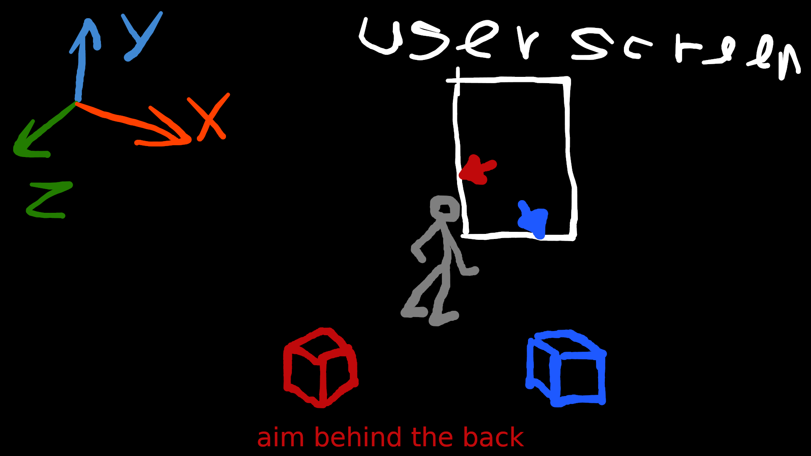

# aframe-aim-component
A-FRAME component that points entity behind the back by arrow at screen border
# Concept #

 This component should help the user understand which way he needs to turn to see the target object, which is not currently on the screen.

# Participation #

This project is only an outline of the component at this point. It is functional enough to understand the concept, but needs to be refined.

Participants are welcome to work together to bring this component to a working state!

There is a thread on the forum where work on this component and existing problems are discussed: 

https://stackoverflow.com/questions/74328030/draw-a-pointer-on-the-edge-of-the-screen-that-points-to-the-target-object-behind

You are welcome to improve this code.